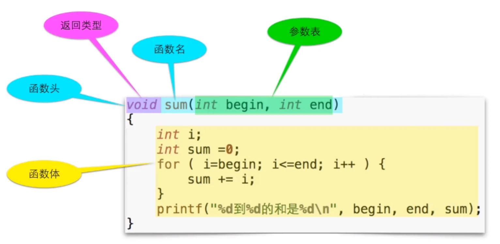
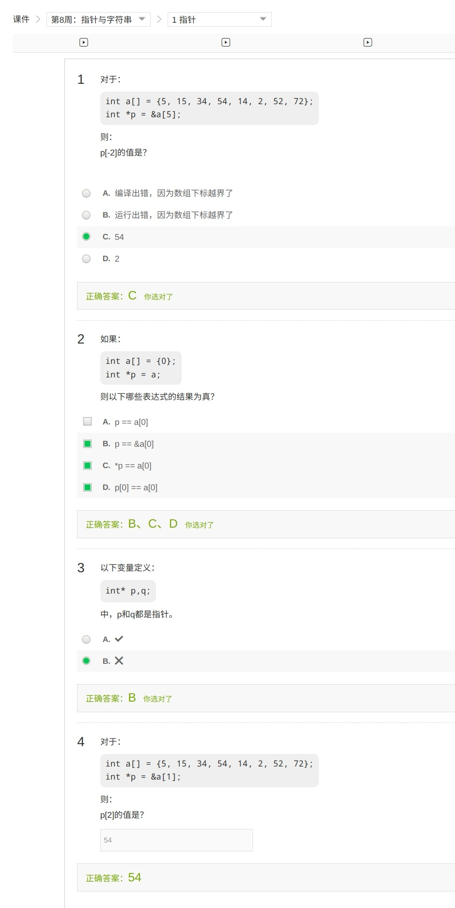
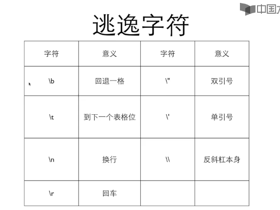
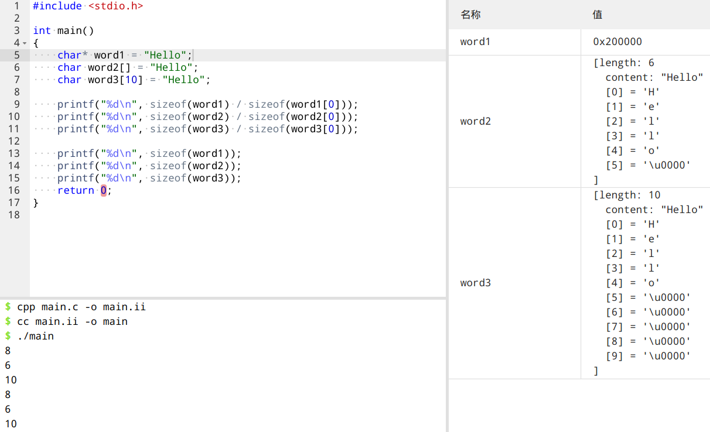

# 目录

[toc]

## 整型

- 使用`int`声明
- 输出/输入时使用`%d`匹配

## 浮点数

## 数组

```c
#include <stdio.h>
int main()
{
    int numbers[9];
    for (int i = 0; i <= 9; i++) {
        numbers[i] = i;
    }

    for (int i = 0; i <= 9; i++) {
        printf("%d\n", numbers[i]);
    }
    return 0;
}
```

数组是一种容器，其特点是

- 其中所有元素具有相同的数据类型
- 一旦创建，不能改变大小
  ~~只能用确定的数定义数组长度~~
  从 C99 开始可以在定义数组长度时使用变量
- 数组中的元素在内存中依次排列
- 数组`a[2]`可以出现在赋值的左边或右边
  例如`a[2]=a[1]+6`
- 数组的每个单元就是数组类型的一个变量
- `[]`中的数字叫做下标/索引,下标从 0 开始计数
  `a[2]`为数组`a`的第三个元素
- 编译器和运行环境都不会检测下标是否越界，不论是读还是写。
  一旦程序运行，越界的数组访问可能造成问题，导致程序崩溃 _(segmentation fault)_
  但也可能运气好，没造成严重后果
  程序员有责任来保证只使用有效的下标值：[0，数组的大小-1]
  ~~上面的代码示例就是一个越界得不是太明显的屑代码~~

## 函数

函数是一块代码，接收零个或多个参数，做一件事情，并返回零个或**一个**值



```c
int isPrime(int i)
{
    int ret = 1;
    int k;
    for (k = 2; k < i - 1; k++) {
        if (i % k == 0) {
            ret = 0;
            break;
        }
    }
    return ret;
}
```

### 返回类型

- 一个函数里可以出现多个`return`语句，但最好还是遵循单一出口原则，不要整多个 `return`。
- 没有返回值的函数，返回类型设为`void`（就是上面图片中那样），这样的函数不能使用带值的`return`，也可以没有`return`；
  如果函数是有返回值的(返回类型不是`void`),必须使用带值的`return`。

### 函数的声明

- 被调用的函数需要写在调用它的地方在上面，因为 C 的编译器自上而下分析代码，编译器在读取到某个函数时必须要事先知道它，但把这些函数写在 main 前面的话不太美观，于是可以这样：

```c
#include <stdio.h>

void sum(int begin, int end); // 函数的原型声明，以分号结尾
int main()
{
    sum(1, 5); // 调用函数
    return 0;
}

void sum(int begin, int end) // 函数定义
{
    int i;
    int sum = 0;
    for (i = begin; i <= end; i++) {
        sum += i;
    }
    printf("%d到%d的和是%d\n", begin, end, sum);
}
```

- 原型声明的作用预先告诉编译器，`sum`是一个函数，在编译器分析到该函数定义部分时，还会再检查一遍声明和定义是否一致。

- 编译器只检查参数的类型，所以原型里可以不写参数的名字，但是一般都写上。

### 传值

- 调用函数时给的值与声明的参数类型可以不匹配，编译器会自动帮我们转换类型，但很可能它转换的结果不是我们所期望的。~~这是 C 语言传统上最大的漏洞，C 语言之后的语言在这方面都要比 C 严格~~

- 每个函数有自己的变量空间，参数也位于这个独立的空间中，和其他函数没有关系。

```c
// 下面代码其实是无法达到目的的
// 原因见 “本地变量”
#include <stdio.h>

void swap(int a, int b);
int main()
{
    int x, y;
    scanf("%d %d", &x, &y);
    swap(x, y);
    printf("%d %d", x, y);
    return 0;
}

void swap(int a, int b)
{
    int t = a;
    a = b;
    b = t;
}
```

- 常常把声明与定义函数时的参数叫做形参，把调用函数时传入的参数叫做实参，这样容易让我等初学者混淆，其实他们之间就是**参数和值**的关系：我们在声明与定义函数时定义若干参数，在调用函数时传给它对应的若干个值；函数调用只做了一件事，那就是**传值**。~~和变量名无关~~

### 本地变量

- 又名局部变量、自动变量
- 函数每次运行，就产生了一个独立的变量空间，在这个空间中的变量，是函数的这次运行所独有的，称作本地变量。
- 定义在函数内部的变量就是本地变量
- 参数也是本地变量。
- 变量的生存期(变量出现到消亡)和作用域(代码内可以访问该变量的范围)：大括号内(块)。

- 本地变量定义在块内
  - 它可以定义在函数的块内
  - 也可以定义在语句的块内
  - 甚至可以随便拉一对大括号来定义变量
  - 程序运行在这个块内前，其中的变量不存在，离开这个块，其中的变量就消失了。

```c
    { // 这也是个块
        int xxx = 666;
        printf("%d", xxx);
    }
```

- 块外面的定义在块里面仍然有效
- 如果在块内定义了和块外同名的变量，则掩盖外面的(仅在块内“圈地自萌”，出去块以后就会恢复原值)
- 不能在一个块内定义同名的变量
- 参数在进入函数时被初始化

### 其他

- 形似`void foo()`的声明表示不知道要传入哪种参数、几个参数
- 形似`void foo(void)`的声明表示该函数没有参数
- 调用函数时的圆括号里的逗号是标点符号不是运算符
  - `foo(a,b)` 逗号是标点符号，传入两个参数
  - `foo((a,b))` 传入了一个参数，逗号是运算符
- C 语言不允许函数嵌套定义
  - 可以在一个函数内声明另一个函数
  - 但不能在一个函数内定义另一个函数
- ~~可以在声明变量的同时声明函数(不推荐)~~
  - ~~`int i, j, sum(int a, int b);`~~
- ~~`return` 后面可以加圆括号，但没有任何意义，不要这样做~~
  - ~~`return(i);`~~
- 关于`main`
  - `main` 是我们写的程序的入口
  - `int main()` 也是一个函数

## 二维数组

```c
    int a[][5] = { // 初始化一个二维数组
        { 0, 1, 2, 3, 4 },
        { 2, 3, 4, 5, 6 },
    };
```

- 必须给出列数，行数可以由编译器来数
- 每行一个`{}`，用逗号分隔
- 最后一个逗号可带可不带，80 年代的计算机书上都让带，但现在时代变了
- 最后的逗号可以存在(如果省略，表示补零)
- 大括号也可以不写，但为了方便人阅读，还是写上为好
- 可以用定位

## 数组运算

- 数组的集成初始化

```c
int a[] = {2,3,4,5,6,7};
```

- 直接用大括号给出数组的所有元素的初始值
- 不需要给出数组的大小，编译器会自动数

```c
int a[10] = { [0] = 2, [2] = 3, 6 };
int b[10] = { 8 };
```

- 用[n]在初始化数据中给出定位
- 没有定位的数据接在前面的位置后面
- 其他位置的值补零
- 也可以不给出数组大小，让编译器算
- 特别适合初始数据稀疏的数组

```c
int d[10] = { 8 };
printf("%d\n", sizeof(d)); // 数组的大小
printf("%d\n", sizeof(d[0])); // 数组中第一个元素的大小
printf("%d\n", sizeof(d[2])); // 数组中第三个元素的大小
printf("%d\n", sizeof(d) / sizeof(d[0])); // 数组内元素数量
```

- `sizeof()`给出括号内变量所占据的内容的大小，单位是字节
- 相同数据类型的大小是恒定的

```c
int a[] = {2,3,4,5,6,7};
int b[] = a; // 错误做法！
```

- 数组变量本身不能被赋值
- 要把一个数组内的所有元素交给另一个数组，必须采用遍历

- 遍历数组通常使用`for`循环，让循环变量`i`从 0 到数组的长度，这样循环体内的 i 正好是数组最大的有效下标
- 常见错误：

  - 循环结束条件<=数组长度
  - 离开循环后，继续用`i`的值做数组元素的下标

- 数组作为函数参数时
  - 不能在[中给出数组的大小]
  - 不能再利用`sizeof`计算数组的元素个数

### 搜索

> 在一个数组中找到某个数的位置（或确认是否存在）

- 遍历
- 二分查找
  - 必须在有序数据中进行查找

### 排序初步

```c
#include <stdio.h>
int max(int a[], int len)
{
    int maxid = 0;
    for (int i = 0; i < len; i++) {
        if (a[i] > a[maxid]) {
            maxid = i;
        }
    }
    return maxid;
}

int main()
{
    int a[] = { 12, 34, 56, 78, 98, 76, 54, 32, 1 };
    int len = sizeof(a) / sizeof(a[0]);

    for (int i = len - 1; i > 0; i--) {
        int maxid = max(a, i + 1);
        // swap a[maxid],a[len-1]
        int t = a[maxid];
        a[maxid] = a[i];
        a[i] = t;
    }

    for (int i = 0; i < len; i++) {
        printf("%d ", a[i]);
    }

    return 0;
}
```

## 指针

### 运算符`&`

- `scanf(“%d”,&i);`里的`&`
- 它的作用是获得变量的地址，它的操作数必须是变量
  - `int i=0;printf("%x\n", &i);`
- 地址的大小是否与 int 相同取决于编译器(32 位的相同，64 位的不相同)

  - `int i=0;printf("%p\n", &i);`

- `&`不能对不是变量的东西取地址

### 指针

```c
int i;
int* p = &i; // *表示p是一个指针，指向的是一个int，

// 下面两行意思是一样的，
// 都表示p是一个指针，指向的是一个int，q都是一个普通的int类型变量
int* p,q;
int *p,q;
// * 并不是加给了“int”，而是加给了“p”
// “*p” 是一个int，于是p是一个指针
// 并没有“int *”这种类型
```

- 指针类型的变量，就是保存地址的变量
- 变量的值是内存的地址
  - 普通变量的值是实际的值
  - 指针变量的值是具有实际值的变量的地址

- `void f(int *p);`
  - 在被调用时得到了某个变量的地址
  - `int i=0;f(&i)`
  - 在函数里可以通过指针来访问外面这个i

```c
#include <stdio.h>

void f(int* p);
void g(int k);

int main(void)
{
    int i = 6;
    printf("&i=%p\n", &i); // 打印i的地址
    f(&i); // 把i的地址交给函数f()里的变量p
    g(i); // 把i的值交给函数g()里的变量k
    return 0;
}

void f(int* p)
{ // 在函数里可以通过指针来访问外面的i
    printf(" p=%p\n", p);
    printf("*p=%d\n", *p); // 这里 *p 作为一个整体时表示地址对应变量的值
    printf("sizeof(p)=%d\n", sizeof(p));
    printf("sizeof(*p)=%d\n", sizeof(*p));
    *p = 26; // 把地址为 p 的变量的值改为26
}

void g(int k)
{
    printf("k=%d\n", k);
}
```

- `*`是一个单目运算符，用来访问指针的值所表示的地址上的变量

  - 可以做左值也可以做右值

  - `int k = *p;`

    `*p = k+1;`

### 指针与数组

- 传入函数的数组
  - 函数参数表的数组实际上是一个指针

  - 但是可以用数组的运算符`[]`进行运算
  - 以下四种函数原型是等价的：
    - `int sum(int *ar,int n);`
    - `int sum(int *,int);`
    - `int sum(int ar[],int n);`
    - `int sum(int [],int);`

- 数组变量是特殊的指针，所以
  - `int a[10]; int* p=a;` // 无需用 & 取地址
  - `a == &a[0]` // 数组的单元表达的是变量，需要用&取地址

- `[ ]` 运算符可以对数组做，也可以对指针做
  - `p[0]`<==>`a[0]`
- `*`运算符可以对指针做，也可以对数组做
  - `*a=25`
- 数组变量是一个 const 的指针，所以不能被赋值
  - `int a[]` <==> `int * const a = ....`



## 字符类型

### 字符类型的输入与输出

- char 是一种整数，也是一种特殊的类型：字符
  - 用单引号表示的字符字面量：`‘a’`,`‘1’`
  - `‘ ’`也是一个字符
  - `printf`和`scanf`里用`%c`来输入输出字符

```c
#include <stdio.h>
int main()
{
    char a;
    char c;
    char d;
    int b;
    b = 49;
    c = 1;
    d = '1';
    scanf("%c", &a);
    if (c == d) {
        printf("c=d\n");
    } else {
        printf("c!=d\n");
    }
    printf("a='%c' a=%d\n", a, a);
    printf("b='%c' b=%d\n", b, b);
    printf("c='%c' c=%d\n", c, c);
    printf("d='%c' d=%d\n", d, d);
    return 0;
}
```

- 如何输入`'1'`这个字符给`char c`?
  - `scanf("%c",&c)`—> 1
  - `scanf("%d",&i);c=i;`—> 49
- `‘1’` 的ASCII编码是49，所以当`int b == 49`而且用`%c`匹配时，它代表1
  - `printf("%d %c",c,c)`
- 一个49各自表述

```c
#include <stdio.h>
int main()
{
    int i = 1;
    char c = 'A';
    // scanf("%d %c", &i, &c);
    printf("i=%d, c=%d,c='%c'\n", i, c, ++c);
    printf("%d\n", 'Z' - 'A');
    return 0;
}
```

- 一个字符加一个数字得到ASCII码表中的那个数之后的字符
- 两个字符的减，得到它们在表中的距离

### 大小写转换

- 字母在ASCII表中是顺序排列的
- 大写字母和小写字母是分开排列的，并不在一起
- `‘a’-'A'`可以得到两段之间的距离,于是
  - `a+'a'-'A'`可以把一个大写字母变成小写字母
  - `a+'A'-'a'`可以把一个小写字母变成大写字母

```c
#include <stdio.h>
int main()
{
    char a = 'A';
    char b = 'b';
    printf("%c %c\n", a + 'a' - 'A', b + 'A' - 'a');
    return 0;
}
```

### 逃逸字符



```c
#include <stdio.h>

int main()
{
    printf("123\b\t456\n");
    printf("123\bA\t456\n");
    return 0;
}
/*
// 将会得到如下输出
123     456
12A     456
*/
```

## 字符串

- 以`0`（整数0）结尾的一串字符
  - `0` 或`\0`是一样的，但是和`‘0’`不同
- `0`标志字符串的结束，但它不是字符串的一部分
  - 计算字符串长度的时候不包含这个`0`
- 字符串以数组的形式存在，以数组或指针的形式访问
  - 更多的是以指针的形式
- `string.h`里有很多处理字符串的函数

```c
#include <stdio.h>

int main()
{
    char* word1 = "Hello";
    char word2[] = "Hello";
    char word3[10] = "Hello";

    printf("%d\n", sizeof(word1) / sizeof(word1[0]));
    printf("%d\n", sizeof(word2) / sizeof(word2[0]));
    printf("%d\n", sizeof(word3) / sizeof(word3[0]));

    printf("%d\n", sizeof(word1));
    printf("%d\n", sizeof(word2));
    printf("%d\n", sizeof(word3));
    return 0;
}
```



### 字符串常量

- `“Hello”`
- `“Hello”`会被编译器变成一个字符数组放在某处，这个数组的长度是6，结尾会自动加上一个表示结束的`0`
- 两个相邻的字符串常量会被连接起来
  - `printf("Hello","World!");`

- 字符串以数组的形式存在
  - 不能用运算符对字符串做运算
  - 通过数组的形式可以遍历字符串
- 唯一特殊的地方是字符串字面量可以用来初始化字符数组

### 指针，数组？

- 关于`    char* s = "Hello World";`

  - `s`是一个**指针**，初始化为指向一个字符串常量

  - 由于这个常量所在的地方，实际上s是`const char* s`,但是由于历史的原因，编译器接收不带`const`的写法

  - 但试图对`s`所指的字符串做写入会导致严重的后果

  - 如果需要修改字符串，应该用**数组**：

    `char s[] = "Hello World"`

- 用指针还是用数组?

  - 数组：这个字符串在这里
    - 作为本地变量空间自动被回收
  - 指针：这个字符串不知道在哪
    - (只读)
    - 处理参数
    - 动态分配空间

- 所以：

  - 如果要构造一个字符串 —> 数组
  - 如果要处理一个字符串 —> 指针

- `char*`是字符串吗？
  - 字符串可以表达为`char*`的形式
  - `char*`不一定是字符串
    - 本意是指向字符的指针，可能指向的是字符的数组(就像`int*`)
    - 只有它所指的字符数组有结尾的`0`，才能说他所指的是字符串

### 字符串输入输出

```c
char *t = "title";
char *s;
s = t;
```

- 上面三行代码并没有产生新的字符串
- 只是让指针s指向了t所指的字符串
- 对s的任何操作就是对t做的

```c
char string[8];
scanf("%s", string);
printf("%s\n", string);
```

- scanf 读入一个单词（到空格、tab或回车为止）
  - 它是不安全的，因为不知道要读入的内容的长度

#### 安全的输入

```c
scanf("%7s", string);
```

- 在`%`和`s`之间的数字表示最多允许读入的字符的数量，这个数字应该比数组的大小小一
  - 这样的话就不是根据空格来区分单词了，而是根据字符个数

```c
#include <stdio.h>
void f()
{
    char word1[8];
    char word2[8];
    scanf("%7s", word1);
    scanf("%7s", word2);
    printf("%s##%s##\n", word1, word2);
}
int main()
{
    f();
    return 0;
}

/*
如果输入为12345678，(字符数大于7)，
那么将不会要求我们进行第二次输入
而是直接把超出7的部分交给下一个scanf

并将会输出：
1234567##8##

因为现在是根据字符个数区分单词
*/
```


### 常见错误

#### ？？？初始化

```c
char* s1;
scanf("%s",s1);
```

- 以为`char*`是字符串类型。定义了一个字符串类型的变量`s1`就直接用了
- 由于没有对`s1`初始化为0，所以不一定每次运行都出错

####  空字符串

- `char b[100]=""`;
  - 这是一个空字符串,`b[0]=='\0'`
- `char b[]=""`;
  - 这个数组的长度只有1！
  - 放不下任何的字符串

### 字符串计算

- `string.h`
  - `strlen(s)`
    - 返回s的字符串长度(不包括结尾的0)
  - `strcmp(s1,s2)`
    - 比较两个字符串，返回：
      - `0, if the s1 and s2 are equal;` 
      - `a negative value, if s1 is less than s2;` 
      - `a positive value, if s1 is greater than s2.`
  - `strcpy(s1,s2)`
    - 把`s2`指向的字符串拷贝到`s1`指向的空间
    - `s1`必须具有有足够的空间，有越界的风险
  - `strcat(s1,s2)`
    - 把`s2`拷贝到`s1`的后面，结成一个长的字符串
    - 返回`s1`
    - `s1`必须具有足够的空间，有越界的风险
  - `strncpy(s1,s2,n)`
    - 比`strcpy()`多了一个参数n，限制拷贝字符串的数量
  - `strncat(s1,s2,n)`
    - 比`strcat()`多了一个参数n，限制拷贝字符串的数量
  - `strcmp(s1,s2,n)`
    - 比`strcmp()`多了一个参数n，可以实现只判断前n个
  - `strchr(s,c)`
    - 在字符串`s`中找`c`第一次出现的位置(从左至右)
    - 返回`c`第一次出现的位置的指针
    - 返回`NULL`表示没找到
  - `strrchr(s,c)`
    - 从右至左
    - 其余同上